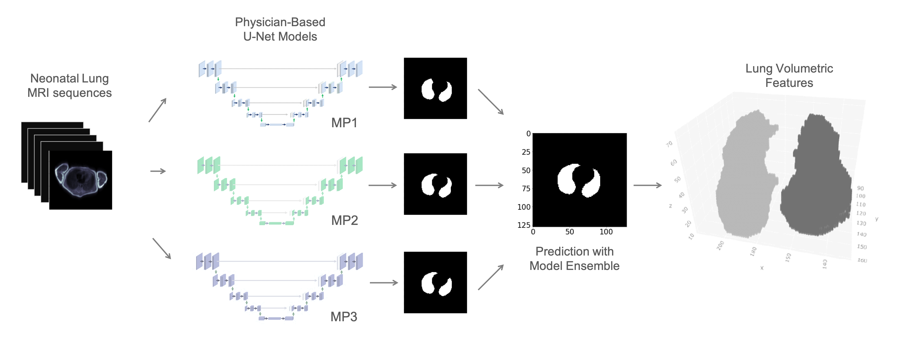

# NeoLUNet

## Project for Neonatal MRI Lung Segmentation with U-Nets


## Contents
- [Introduction](#introduction)
- [Overview](#overview)
- [Content](#content)
- [Usage](#usage)
- [Reference](#reference)

## Introduction
> Quantification of  lung structural information is crucial to standardize and inform diagnostic processes, enable personalized treatment and monitoring strategies.
> MRI can provide quantitative information for assessment of the neonatal lung while avoiding radiation exposure.

## Overview
> We developed an ensemble of deep convolutional neural networks to automatically and with high consistency perform neonatal lung segmentation from MRI sequences.
> A 3D representation of the lung and a clustering method to separate left and right lobes were implemented to calculate volumetric features.

> In addition, ML Models for severity prediction of Bronchopulmonary Dysplasia (BPD) are implemented as an applied example of the use of MRI lung volumetric features for disease prognosis.

## Content

1. [MRI Lung Segmentation](./mri_lung_segmentation)

── 1.1 [Source](./mri_lung_segmentation/src)

────── [Main Script to Process Single Sequence](mri_lung_segmentation/src/main_process_single_sequence.py "main_process_single_sequence.py")

────── [Functions for Lung Segmentation](mri_lung_segmentation/src/segmentation_utils.py "segmentation_utils.py")

────── [Functions for Volumetric Feature Extraction](mri_lung_segmentation/src/lung_volume_utils.py "lung_volume_utils.py")
   
────── 1.1.1  [DL Utils](./mri_lung_segmentation/src/DL_utils)

──────────── [2D UNet Model](./mri_lung_segmentation/src/DL_utils/model2D.py "model2D.py")

──────────── [Segmentation Metrics](./mri_lung_segmentation/src/DL_utils/model2D.py "model2D.py")

────── 1.1.2  [Experiments - Lung Segmentation for Paper](./mri_lung_segmentation/src/paper_experiments)

────── [Script to Process Paper Dataset](mri_lung_segmentation/src/paper_experiments/generate_paper_results.py "generate_paper_results.py")

────── [Script to Evaluate Paper Dataset](./mri_lung_segmentation/src/paper_experiments/segm_evaluation_script.py "segm_evaluation_script.py")


2. [BPD Severity Prediction](./bpd_severity_prediction)

── 2.1 [Experiments for Nested Cross-Validation](./bpd_severity_prediction/src/paper_experiments/)


3. [Paper Resources](./paper_analysis_figures)

── [Statistical Analysis and Figures for Paper](./paper_analysis_figures/1-figures_and_statistical_tests.ipynb)

## Usage
Read Use Instructions [instructions](./cover/instructions.md)
> - Clone the repository
> ```bash
> git clone 'git@github.com:SchubertLab/NeoLUNet.git'
> ```
> - Install dependencies
> ```bash
> conda env create -f neolunet_env.yml
> ```

## Data and Models
> Download the pre-trained 2D-UNet MRI neonatal lung segmentation models here:
> 
> <a href=https://doi.org/10.5281/zenodo.10686751>Zenodo Link</a>
> 
> Segmentation performances and features per MRI-sequence also available in the link.

## Reference
> Radiology Artificial Intelligence (2023): <a href=https://doi.org/10.1148/ryai.220239>Link</a>
